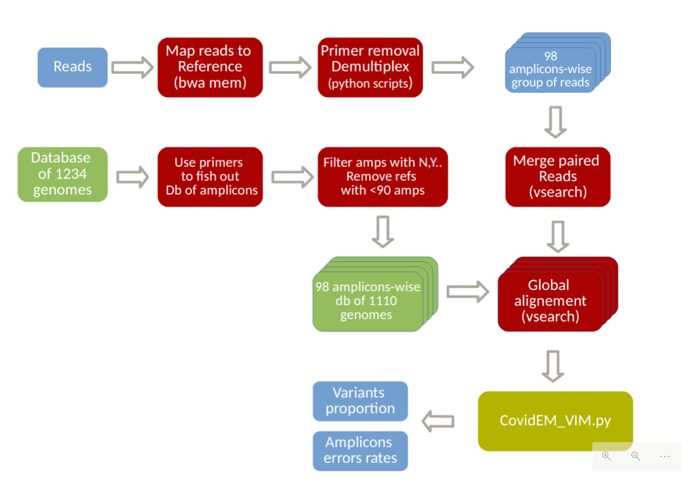

# CovMix
CovMix is a pipeline developed for inferring  covid variant proportion from amplicon sequencing using paired reads. It is entirely build on snakemake. 

**What does the  pipeline do :**
 1) read primer removal/trimming/filtering
2) demultiplexing per amplicons
3) merge reads
4) per amplicon global alignement 
5) EM algorithm to infer proportions

Numbers on this figure are related to the the specific use of a 1234 genome database from GISAID used in conjunction with the Artic_V3 primer scheme. 

###  How to install CovMix:
You can have a look at  [conda_env.yaml](https://github.com/Sebastien-Raguideau/Metahood/blob/master/Conda_envs/conda_env.yaml), for an exhaustive list of all dependencies. Conda is used to install all dependencies, however we advise on using the faster mamba in order to resolve the environment. The following command line will create the environment : 
```
cd path_to_repos/CovMix
mamba env create -f conda_env.yaml
```

You then need to activate the corresponding environment using : 

    conda activate CovMix

##  How to run CovMix:

    conda activate CovMix
    path_to_repos/CovMix/CovMix.py PRIMER --config <config file> --cores <nb threads> -s <snakemake options> 

Primer correspond to the primer scheme used for sequencing, at the moment it has to be one those 3:
- Artic_V3
- Nimagen_V2
- Nimagen_V3.

 ### Configuration file
 The apparent lack of parameters is deceiving as all the complexity is hidden in a configuration file.  
[config_with_comment.yaml](https://github.com/Sebastien-Raguideau/CovMix/blob/main/config_with_comment.yaml)
This config file is in the yaml format and indentation is critical. Space is needed after ":" .

The following document all possible arguments, most of them are optional, for a quickstart just refer to the following template: [minimal_config.yaml](https://github.com/Sebastien-Raguideau/CovMix/blob/main/minimal_config.yaml)

 ------ Resssources ------
  *  **threads** : Each task is allowed a maximum of 8 cores by default, you can change this value.

------ Output folder ------
  * **execution_directory** : Output folder, 

------ Path to data folder ------
  * **data**: Path to sample folders.
    * all samples are required to be stored in independent folders, the folder name will later define sample names in output folders. 
	- only paired reads
	- there must be a unique file with "_R1" and a unique file with "_R2" 
	- only following extensions : .fq, .fq.gz, .fastq, .fastq.gz, .fa, .fa.gz, .fasta, .fasta.gz 
- **data_regex**: list of regular expressions for selecting specific folder from path specified under **data**. If this field is not documented, all folder from **data** are used. Example
		- ["s*","d*"] select all folder starting with s and d 
		- ["*"] select all folders

------ Database definition -------

- **database**:
	- **fasta**: path to database, amplicons from the reference will with degenerated bases will be removed
	- **tree**: tree build with the same sequence as in **fasta**, if not specified the pipeline will build it.


------ Additional parameter -------
- **trimming_strictness**: values can 0, 1, 2
	- 0 : only keep properly paired reads
	- 1: same as 0 and but only keep reads with both primer presents
	- 2: same as 1 but only keep reads with both primer complete/identical to primer definition 
- **Proportion_Threshold**: values can be between [0,1], Reference found with proportions smaller that this threshold will be ignored
-  **amplicon_to_run**: path to file listing subselection of amplicons number to use.
- **genome_to_run**: path to file listing subselection of  genome name from the database to use.
- **min_reads_per_amp**: any amplicon with less than that number of merged read will not be used
- **max_reads_per_amp**: maximum number of reads used per amplicons, this exists due to speed issues (don't have too much reads please)


