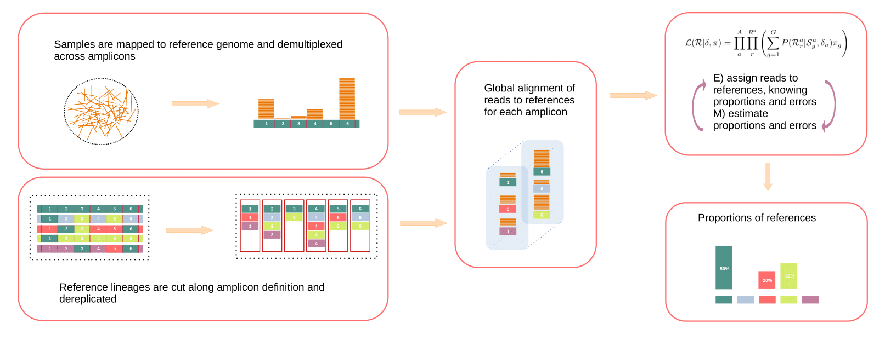
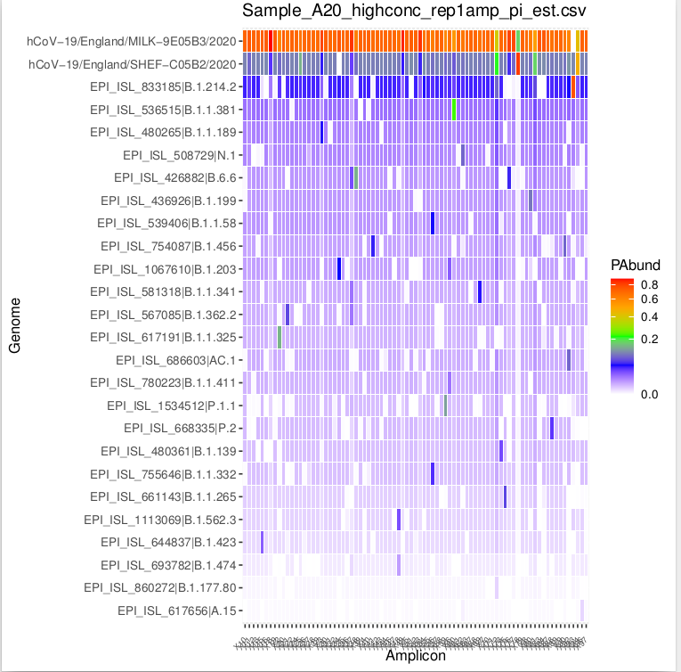
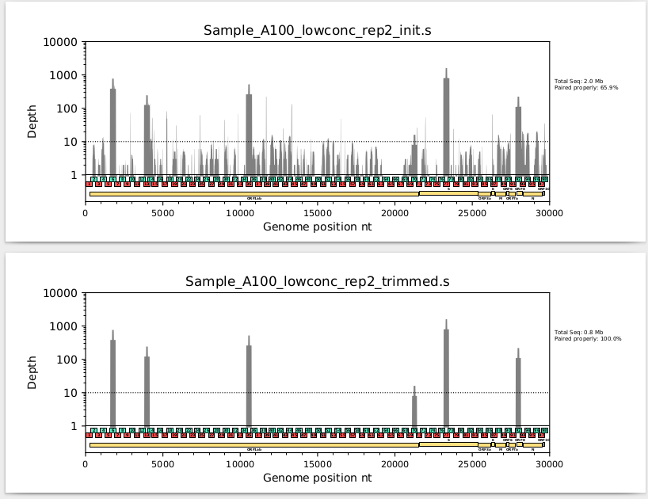
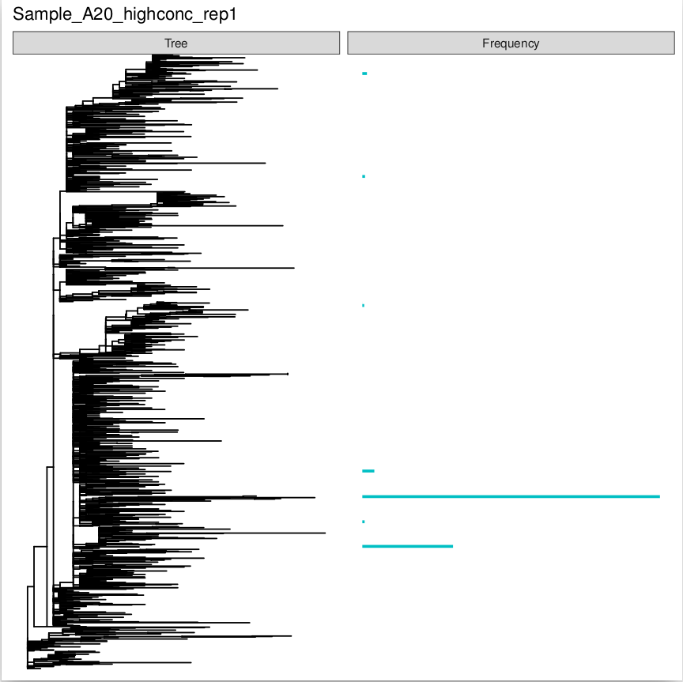

# CovMix
CovMix is a pipeline developed for inferring  SARS-CoV-2 variant proportions from amplicon sequencing using paired reads.  CovMix is a pipeline built entirely on snakemake. 

**What does the  pipeline do :**
1) Read primer removal/trimming/filtering
2) Demultiplexing by amplicon
3) Per amplicon global alignement 
4) EM algorithm to infer proportions


###  How to install CovMix:
You can have a look at  [conda_env.yaml](https://github.com/Sebastien-Raguideau/CovMix/blob/main/conda_env.yaml),  for an exhaustive list of all dependencies. Creation of the environment can be done with conda, though it is strongly advised to use mamba instead for the sake of speed.
The following commands will work: 

First, clone the CovMix repository - in your analysis directory, type:

    git clone https://github.com/chrisquince/CovMix.git
Second, install mamba - if you already have conda :

    conda install mamba -c conda-forge

Then, in the \<path to your analysis directory\>/CovMix directory, type:
```
cd path_to_repos/CovMix
mamba env create -f conda_env.yaml
```
You then need to activate the corresponding environment using : 

    conda activate CovMix

to deactivate the environment, type:

    conda deactivate


##  How to run CovMix

    conda activate CovMix
    path_to_repos/CovMix/CovMix.py <primer> <config file> --cores <nb threads> -s <snakemake options> 

\<primer\> correspond to the primer scheme used for sequencing, at the moment it has to be exactly one of these schemes:
- Artic_V3
- Artic_V4
- Artic_V4-6
- Nimagen_V2
- Nimagen_V3.
- Nimagen_V4

These scheme are specified in the [primer_schemes](https://github.com/chrisquince/CovMix/tree/main/primer_schemes "primer_schemes") folder. You can install your own scheme by creating similar folder with same files types.

Covmix is designed to handle either illumina paired reads or nanopore long reads. By default data is assumed to be paired reads. To specify nanopore reads, use the flag `--datatype ont`

Covmix is written as modular pipeline with the multiple steps. Using the flag `--mode` it is possible to run a specific step. By default, all steps are run sequentially. 
- **all**: default value, run all steps, one after another 
- **map**: map reads to Wuhan-Hu-1, and demultiplex reads per amplicons 
- **amplicons**: merge paired reads, dereplicate reads, global alignment against database
- **em**: EM algorithm to assign reads to references and estimate proportions;
- **snv**: Use varscan to call snv and compare called snv to snv as predicted by proportions of reference lineages snv.
	

The flag -s is used to pass snakemake specific options, such as reruning a specific rule, creating a specific file, doing a dry run etc. 


 ### Configuration file
Most arguments are specified inside the config file, here is a template: [config_with_comment.yaml](https://github.com/Sebastien-Raguideau/CovMix/blob/main/config_with_comment.yaml)

This config file is in the yaml format (https://en.wikipedia.org/wiki/YAML). Indentation are used to build hierarchical relationship between elements and should be conserved as in the template. Another common mistake is to forget a space after colon. You can check the validity of your file at : http://www.yamllint.com/ 

The following list documents all possible arguments. Most of these are optional; for a quickstart please just refer to the following template: [minimal_config.yaml](https://github.com/Sebastien-Raguideau/CovMix/blob/main/minimal_config.yaml)

 ------ Resources ------
  *  **threads** :(OPTIONAL) Each task is allowed a maximum of 8 cores by default, you can change this value. Does not change total amount of cpu CovMix uses.

------ Output folder ------
  * **execution_directory** : Specifies the path to your output folder.

------ input data folder ------
  * **data**: Specifies the path to the folders storing your input data files. Please note that this should be the path to the **overarching sample directory** containing a unique folder per sample.    
    * All samples are required to be stored in independent folders, as the folder name will later define sample names in output folders. 
    * Any file ending with the any of the following will be considered a sample by CovMix: .fastq.gz,, .fastq, .fq.gz, .fq, .fa, .fasta, .fasta.gz, .fa.gz.
	- For paired reads, each sample folder there must be two unique files for each sample : one with "_R1" and  one with "_R2".
	- For nanopore long reads, only 1 sample should be found per folder.
- **data_regex**: (OPTIONAL) A list of regular expressions for selecting specific a folder from the path specified under **data**. If this field is not used, all folders from the input path specified in **data** are selected. For example the **data_regex** specification
		- ["s*","d*"]  will select all folders in the input path starting with s and d; 
		- ["*"] will select all folders in the input path. 

------ Database definition -------

- **database**:
	- **fasta**: Denotes the path to the reference  SARS-CoV-2 genomes database. 
	- **msa**: (OPTIONAL) Specify the path to multiple sequence alignment of the database. If not specified this will be recomputed. As this step may takes some time, this option allows to skip alignment when running multiple dataset with the same database.
	- **tree**:(OPTIONAL) If the ,Specifies the path to a phylogenetic tree built from sequence stored in **fasta**. If this field is not included in the config file, CovMix will in turn generate one from aforementioned **fasta** database.


------ Additional parameter -------
- **plot_tree**: (OPTIONAL) specify either value [True,False].  Will use the reference lineage to build a phylogenetic tree, which will be in turn used to output leneage proportions side by side with phylogenetic tree.  
- **Proportion_Threshold**: (OPTIONAL) Values can be between [0,1], Reference variants found with in proportions smaller than this threshold will be ignored. The default is 0.025
- **amplicon_to_run**: (OPTIONAL) The path to a file listing a sub-selection of amplicons to use.
- **genome_to_run**:  (OPTIONAL) The path to a file listing a sub-selection of genome names to use from the reference database.
- **min_reads_per_amp**: (OPTIONAL) Any amplicon with less than the specified number of merged reads will not be considered. The default is 40.
- **max_reads_per_amp**: (OPTIONAL) Specifies the maximum number of allowable reads per amplicon. This is set to facilitate speed (don't use too many reads please). The default is 5000.

**NB** - As GISAID is the current main reference in terms of SARS-CoV-2 genomes and is, as such, likely to be used in conjunction with CovMix,  we would like to remind users that it requires strict compliance with its data usage policies (please see [https://www.gisaid.org/registration/terms-of-use/](https://www.gisaid.org/registration/terms-of-use/)). Some outputs of CovMix will be as a consequence also subject to the same usage policy. Namely, tree built by CovMix and the series of fasta files splicing database entries per amplicons (see "refs" folder). 

##  Expected Outputs
### Important!
Read description of **selected_amp.tsv** and **degen_summary.tsv**, it explains why you may have missing samples or why proportions are strangely equals across multiple references.

### Output folder description:
**selected_amp.tsv** : Depending on the input data and the parameters set, not all amplicons will be run. For example, if an amplicon is covered by fewer reads than the value set through **min_reads_per_amp** (default=40), it will not be ignored.
Additionally, if as a result of previous step, no amplicon is left for a sample, then the sample is dropped out of the analysis. To understand why a sample did not have sufficient read mapped to any amplicon, you can have a look at the sample folder for the trim.log file. A common problem is to use the wrong set of primers which throw off CovMix.
Inside this file, each line start by a sample name followed by the list of amplicons evaluated.


### "results" folder
- **degen_summary.tsv**: If too many amplicons are missing and some references are found to be identical on the remaining one, we have no choice but to consider these references as a single entity. degen_summary.tsv, summarise that information for each sample and all references. Columns are sample name, name of representative, list of degenerate references separated by a custom delimiter (|----|).
- **proportions.tsv**: A .tsv table of detected SARS-CoV-2 variants and their estimated proportions in all samples. **Important** in case of degeneracy between multiple references, proportion assigned to representative is split equally between all degenerated references.
-  **amp_cnts.tsv**:  A .tsv table of the number of reads mapping to each reference amplicon after filtering/trimming.
- **snv_table.tsv**: A .tsv table used to generate snv_plot.pdf. Columns are, [sample, origin, position, base, counts_observed, counts_predicted, total_counts]. Origin is either the list of lineages possessing the snv or "observed" if it has not been predicted. Here snv are only defined as pair (position, base) not seen on the  Wuhan-Hu-1 genome. total_counts columns gives the depth of coverage for the expected base from Wuhan-Hu-1 at this position. 
- **Proportions.pdf**: A .pdf regrouping plot summarising all samples. For each sample it shows the proportions of detected SARS-CoV-2 variants present in the reference database (sorted by frequency) and plots the threshold set in **Proportion_Threshold** as a dashed red line. Degenerated lineages are named after their representative but plotted in green. Parenthesis after representative name, informs how many references are grouped together.

 

 - **amplicons_wise_freq.pdf** : A one page/plot per sample, for all detected SARS-CoV-2 variants, showing the proportion of reads assigned on a per amplicon basis. This figure is useful for manual curation and sense-checking, as the detection of SARS-CoV-2 variants  driven uniquely by high proportion of only amplicon, is likely to be erroneous
 
  

 - **amplicon_wise_read_cnt.pdf**: Coverage of the SARS-CoV-2 genome and each amplicon before and after the reads trimming/filtering process.
 
     

- **snv_plot.pdf**: Plot showing abundance of snv as predicted using varscan as a function of  snv abundance generated by predicted proportion from the proportion.tsv file.

 

 - **tree_freq.pdf**: (OPTIONAL), Only present if the option plot_tree has been set to True in the config file. Represents the proportions of SARS-CoV-2 variants detected in a sample and their relative positions on a SARS-CoV-2 phylogeny. This demonstrates the relatedness of any SARS-CoV-2 variants detected in the sample. 
 
   


### "refs" folder
This folder contains 
- The bed file used to define primers
- A fasta file of the SARS-CoV-2 genome used for primer definition
- A symbolic link to the specified SARS-CoV-2 genome database
- A folder called **\<primer\>_amps_seqs**, containing :
	- A fasta file per amplicon, containing each all different amplicons sequences observed from the database
	- amp_name_mapping.tsv: a file containing mapping of reference to sequences names in each .fa files. 
- db_stats.tsv : A table giving  for each entry of the database, it's name, number of amplicons, number of unique amplicon, maximum number of shared amplicons with another reference and corresponding name.
- aSelect.tsv : This file list all amplicons selected for use when estimating variants proportions.  It is required for running the EM algorithm. If not specified in the config file, it will be generated in this folder with all amplicons selected.
- gSelect.tsv : This file list all genome (database entries) selected for use when estimating variants proportions.  It is required for running the EM algorithm. If not specified in the config file, it will be generated in this folder with all available   variant from the database selected.
- a **tree** folder contraining:
	- EITHER the symbolic link to a specified tree in the config file
	- OR .msa and .nwk files generated by CovMix though mafft/iqtree from the database fasta file.  


### "Samples" folder
Each sample will have it's own folder with the following : 
- The previously described 4 type of .pdf found in the results folder, but this time uniquely for each sample. 
- A .sam file of initial reads (_init.sam) and trimmed reads (*_trimmed.sam) to the SARS-CoV-2 refereence genome used for primer definition (currently with all primer scheme this correspond to Wuhan-Hu-1).
- <SAMPLE\>\_trimmed\_\<R\>.fastq.gz files corresponding to reads after trimming/filtering.
-  trim.log : A log file which shows information on the trimming process.
- An **amplicons_reads** folder which contains all the following files per amplicon :
	-  R1/R2 fastq.gz trimmed/filt reads
	-  merged reads
	- .sam/.m6 from vsearch global alignment of merged reads
- The **EM_runs** folder described below.

### EM_runs
The outputs in this folder summarise the results of the expectation-maximisation algorithm underpinning the estimates of proportions derived for each sample evaluated with CovMix:
- **\<SAMPLE\>_total_pi_est.csv** :  A .csv file summarising the frequency mean and std for each SARS-CoV-2 variant in the database from the config file.
- **\<SAMPLE\>_total_delta_est.csv**:  A .csv file summarising estimated error rate per amplicon.
- **\<SAMPLE\>_total_z_est.csv**:  A .csv file summarising the probabilty for each read of originating from each entry of the SARS-CoV-2 variant database.
- **\<SAMPLE\>_total_amp_pi_est.csv**: The estimated proportion for each entry of the SARS-CoV-2 variant database,   for each amplicon.
-  **Filt_** : In case the thresholding by proportion (i.e using the threshold set in  **Proportion_Threshold**) does not remove all proportions, the 4 previous  files will be regenerated with **Filt** in the name, from the algorithm rerunning after removing SARS-CoV-2 variants with proportions smaller than threshold.    
- **SAMPLE_totalamp_map.csv**: A .csv file representing the mapping of each read name to the amplicon it maps to. 
- A log of the algorithm, **\<SAMPLE\>_total.log**
